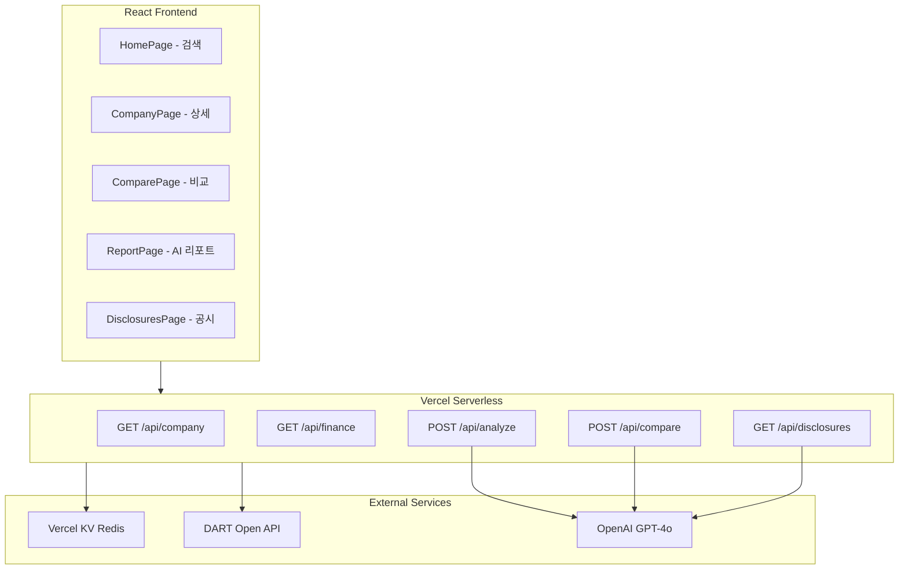

# WallStreet Value — Full MVP 구현 계획

## 현재 상태

워크스페이스 [`c:\Users\gwang\Desktop\groom-260529-dart-api`](c:\Users\gwang\Desktop\groom-260529-dart-api)는 **완전히 비어 있음**. 명세서 구조대로 **Greenfield**로 프로젝트를 초기화합니다.

## 아키텍처



## 1. 프로젝트 스캐폴딩

### 초기 설정

- **Vite + React 18 + TypeScript** 프로젝트 생성
- 의존성: `tailwindcss`, `zustand`, `recharts`, `react-router-dom`, `@vercel/kv`, `openai`
- Vercel 배포용 [`vercel.json`](vercel.json): SPA rewrite + `/api/*` 라우팅
- 환경변수 [`.env.example`](.env.example):

```env
DART_API_KEY=
OPENAI_API_KEY=
KV_REST_API_URL=
KV_REST_API_TOKEN=
```

> API Key는 **서버리스 함수에서만** 사용. 클라이언트 번들에 절대 포함하지 않음.

### 디렉터리 구조 (명세서 반영)

```txt
src/
├── api/          # 프론트 fetch 클라이언트 (openai.ts 제외 — 서버 전용)
├── components/   # layout, charts, compare, reports, ui
├── pages/        # Home, Company, Compare, Report, Disclosures
├── store/        # useCompareStore.ts
├── hooks/
├── types/
└── utils/        # 재무 정규화, 지표 계산

api/              # Vercel Serverless Functions
├── company.ts
├── finance.ts
├── analyze.ts
├── compare.ts
├── disclosures.ts
└── _lib/         # dart client, kv cache, normalize, prompts
```

---

## 2. 공통 인프라 (모든 Phase의 기반)

### DART API 클라이언트 — [`api/_lib/dart.ts`](api/_lib/dart.ts)

| 용도 | DART 엔드포인트 | KV 캐시 TTL |
|------|----------------|-------------|
| 기업코드 목록 | `corpCode.xml` (ZIP→XML) | 24h |
| 기업 개요 | `company.json` | 12h |
| 재무제표 | `fnlttSinglAcntAll.json` | 6h |
| 공시 목록 | `list.json` | 30min |
| 공시 원문 | `document.xml` | 1h |

### Vercel KV 캐싱 — [`api/_lib/cache.ts`](api/_lib/cache.ts)

- Key 패턴: `corp:list`, `corp:{corpCode}`, `finance:{corpCode}:{year}`, `disclosures:{corpCode}`
- 캐시 miss 시 DART 호출 → KV 저장 → 반환
- 동일 요청 중복 방지를 위한 in-flight dedup (함수 스코프 Map)

### 재무 데이터 정규화 — [`src/utils/normalize.ts`](src/utils/normalize.ts)

DART 계정명 변동(예: `매출액` / `수익(매출액)` / `영업수익`)을 통합 매핑:

- 매출액, 영업이익, 당기순이익, 자산총계, 부채총계, 영업활동현금흐름
- 연도별 BS/IS/CF 병합 → `FinancialStatement[]` 타입

### 가치투자 지표 계산 — [`src/utils/metrics.ts`](src/utils/metrics.ts)

재무제표 + (선택) 시가총액으로 계산:

- PER, PBR (시가총액 없으면 UI에 "N/A" 표시)
- ROE, ROA, 부채비율, 영업이익률
- 매출/EPS YoY 성장률 (전년 데이터 필요)

> **시가총액**: MVP에서는 DART에 없으므로 Phase 1~2는 N/A 처리. Phase 3 이후 서버에서 Yahoo Finance 등 비공식 소스 조회(실패 시 graceful fallback)를 [`api/_lib/market.ts`](api/_lib/market.ts)에 추가.

---

## 3. Phase 1 — 기업 검색 + 재무제표

### Backend

| Route | 기능 |
|-------|------|
| `GET /api/company?corpCode=` | 기업 기본정보 + 최근 공시 요약 |
| `GET /api/company/search?q=` | 기업명/종목코드 자동완성 (KV corp list 검색) |
| `GET /api/finance?corpCode=&years=5` | 정규화된 재무제표 + 계산 지표 |

### Frontend

- [`src/pages/HomePage.tsx`](src/pages/HomePage.tsx): 검색바 + 자동완성 드롭다운 + 최근 검색
- [`src/pages/CompanyPage.tsx`](src/pages/CompanyPage.tsx):
  - 기업 헤더 (명칭, 종목코드, 업종)
  - 재무 요약 테이블 (최근 5개년)
  - 가치투자 지표 카드
  - Skeleton UI + Suspense lazy loading

### UI 테마 (명세서 §6)

Tailwind 커스텀 토큰 in [`tailwind.config.js`](tailwind.config.js):

- Background: `#FAF9F6`, `#F5F3EF`
- Text: `#1A1A1A`, `#4A4A4A`
- Accent: `#1B4332` (dark green), `#722F37` (burgundy)
- Fonts: `Merriweather` (headlines), `Inter` (body) — Google Fonts

레이아웃: [`src/components/layout/AppLayout.tsx`](src/components/layout/AppLayout.tsx) — WSJ 스타일 헤더, 얇은 구분선, 표 중심, 카드 최소화

---

## 4. Phase 2 — 차트 + 기업 비교

### 차트 — [`src/components/charts/`](src/components/charts/)

Recharts 기반:

- `RevenueChart` — 매출/영업이익/순이익 추이 (Bar/Line combo)
- `ProfitabilityChart` — ROE/ROA/영업이익률 추이
- `BalanceSheetChart` — 자산/부채/ equity 스택

CompanyPage에 통합, 반응형 + 툴팁

### 기업 비교

- [`src/store/useCompareStore.ts`](src/store/useCompareStore.ts): Zustand, 최대 4개 corpCode 관리, localStorage persist
- CompanyPage에 "비교 추가" 버튼
- [`src/pages/ComparePage.tsx`](src/pages/ComparePage.tsx):
  - 2~4개 기업 side-by-side 테이블
  - 비교 항목: 재무제표, 성장률, 수익성, 안정성, 현금흐름
  - Recharts radar/bar로 시각 비교

### Backend

- `POST /api/compare` — Body: `{ corpCodes: string[] }` → 병렬 finance fetch → 정규화된 비교 JSON 반환 (GPT는 Phase 3)

---

## 5. Phase 3 — GPT AI 분석 리포트

### Backend — [`api/analyze.ts`](api/analyze.ts), [`api/compare.ts`](api/compare.ts) GPT 연동

- OpenAI SDK (`gpt-4o-mini` 기본, `gpt-4o` 옵션)
- [`api/_lib/prompts.ts`](api/_lib/prompts.ts): WSJ 톤 프롬프트 템플릿

```
분석 항목: 성장성 / 수익성 / 안정성 / 경쟁력 / 리스크 / 장기 적합성
금지: 매수 추천, 확실한 수익 표현
필수: "참고용 분석", "투자 판단은 사용자 책임" 면책
```

- `POST /api/analyze` — 단일 기업 리포트 생성 (KV 캐시 1h, corpCode+data hash key)
- `POST /api/compare` — GPT 비교 해설 추가 (compare 데이터 + narrative)

### Frontend — [`src/pages/ReportPage.tsx`](src/pages/ReportPage.tsx)

- 신문형 2-column 레이아웃 (`ReportLayout`)
- 섹션: Headline, Executive Summary, Growth, Profitability, Stability, Risks, Long-term View
- 면책 배너 고정 표시
- CompanyPage에서 "AI 리포트 생성" CTA → ReportPage

---

## 6. Phase 4 — 실시간 공시 모니터링

### Backend — [`api/disclosures.ts`](api/disclosures.ts)

- `GET /api/disclosures?corpCode=&days=30` — 공시 목록
- 중요 공시 필터 (키워드): 유상증자, 자사주, 합병, 대규모 계약, 투자
- `POST /api/disclosures/summarize` — GPT로 공시 AI 요약 (document.xml → 텍스트 추출 → 요약)

### Frontend — [`src/pages/DisclosuresPage.tsx`](src/pages/DisclosuresPage.tsx)

- 전체/기업별 공시 피드
- 중요 공시 burgundy 하이라이트 배지
- AI 요약 접기/펼치기
- CompanyPage "최근 공시" 위젯과 연동

> "실시간"은 MVP에서 **폴링(5분) + KV 30min 캐시**로 구현. WebSocket/SSE는 향후 확장.

---

## 7. 라우팅 및 네비게이션

[`src/App.tsx`](src/App.tsx) — React Router v6:

| Path | Page |
|------|------|
| `/` | HomePage |
| `/company/:corpCode` | CompanyPage |
| `/compare` | ComparePage |
| `/report/:corpCode` | ReportPage |
| `/disclosures` | DisclosuresPage |

---

## 8. 보안 및 법적 주의

- 모든 외부 API 호출은 `api/` 서버리스 함수 내부에서만
- GPT 출력 post-processing: 금지 표현 필터 (regex 기반 경고 또는 재생성)
- 모든 Report/Compare AI 결과 하단에 면책 문구 컴포넌트 [`Disclaimer.tsx`](src/components/ui/Disclaimer.tsx)

---

## 9. 배포

1. GitHub repo 생성 → Vercel 연동
2. Vercel Dashboard에서 **KV 스토어** 생성 → env vars 자동 주입
3. `DART_API_KEY`, `OPENAI_API_KEY` 수동 설정
4. `vercel deploy` 또는 Git push CI/CD

---

## 10. 구현 순서 (권장)

```mermaid
gantt
    title MVP Implementation Order
    dateFormat X
    axisFormat %s

    section Foundation
    Scaffold_and_theme           :0, 1
    DART_client_and_KV           :1, 2
    Normalize_and_metrics        :2, 3

    section Phase1
    Search_and_company_API       :3, 4
    Home_and_Company_pages       :4, 5

    section Phase2
    Charts                       :5, 6
    Compare_store_and_page       :6, 7

    section Phase3
    GPT_analyze_and_report       :7, 8

    section Phase4
    Disclosures_and_AI_summary   :8, 9
```



## 핵심 파일 우선순위

1. [`package.json`](package.json), [`vercel.json`](vercel.json), Tailwind/TS 설정
2. [`api/_lib/dart.ts`](api/_lib/dart.ts), [`api/_lib/cache.ts`](api/_lib/cache.ts)
3. [`src/types/finance.ts`](src/types/finance.ts), [`src/utils/normalize.ts`](src/utils/normalize.ts)
4. [`api/company.ts`](api/company.ts), [`api/finance.ts`](api/finance.ts)
5. UI 레이아웃 + HomePage + CompanyPage
6. Charts + ComparePage + useCompareStore
7. [`api/analyze.ts`](api/analyze.ts) + ReportPage
8. [`api/disclosures.ts`](api/disclosures.ts) + DisclosuresPage

## 사전 준비 (사용자)

구현 시작 전 아래 키/리소스가 필요합니다:

- [DART Open API](https://opendart.fss.or.kr/) 인증키
- [OpenAI API](https://platform.openai.com/) 키
- Vercel 프로젝트 + KV 스토어 (배포 시)
